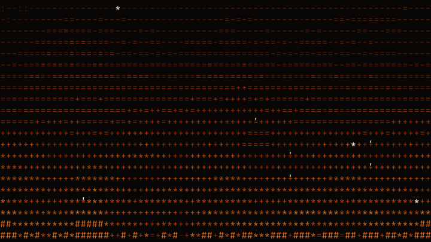
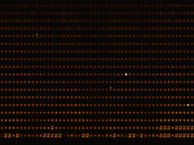
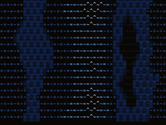
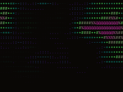

# asciitopia

A library of animated, beautiful ASCII patterns for everybody.

<!-- hero.gif cycles all five patterns: fire → aurora → waves → rain → snow -->


## Why?

Because. I fucking love ASCII art.

## Patterns

v0.1 ships five:

| | Name | Description | Demo |
| --- | --- | --- | --- |
|  | Fire | Rising flames with fuel modes, embers, sparks, and multiple palettes. | TBD |
|  | Rain | Falling drops with fading trails, impact flashes, and splash particles. | TBD |
|  | Snow | Drifting flakes on two depth layers with sway and wind. | TBD |
|  | Waves | Layered sine-and-noise ocean swell in ocean or mono colors. | TBD |
|  | Aurora | Northern lights from drifting fractal noise. | TBD |

## Quickstart

**Vanilla JS** with `@asciitopia/core`:

```ts
import { CanvasEngine, FirePattern } from '@asciitopia/core';

const canvas = document.querySelector('canvas')!;
canvas.width = 800;
canvas.height = 400;

const engine = new CanvasEngine(canvas);
engine.setPattern(new FirePattern());
engine.start();
```

**React** with `@asciitopia/react`:

```tsx
import { AsciiBackground } from '@asciitopia/react';

// Give the canvas real dimensions via CSS; the engine sizes off the
// observed box (position: fixed; inset: 0; width/height: 100%; z-index: -1).
export const App = () => (
  <AsciiBackground className="ascii-bg" pattern="fire" />
);
```

## Configuration

Every pattern takes a partial config over its own defaults. Fire, for example:

```ts
import { FirePattern } from '@asciitopia/core';

const fire = new FirePattern({
  mode: 'campfire', // 'wall' | 'campfire' | 'torch' | 'candles'
  palette: 'lava',  // 'classic' | 'blue' | 'lava' | 'matrix' | 'mono'
  intensity: 8,     // 1–10, fuel heat
  wind: 2,          // -5–+5, horizontal drift bias
});
```

Each pattern exports its own `XxxConfig` type and `DEFAULT_XXX_CONFIG` from `@asciitopia/core`.

## Write your own

Every pattern implements the same interface:

```ts
export interface AsciiPattern {
  init(cols: number, rows: number): void;
  update(dt: number): void;
  render(
    ctx: CanvasRenderingContext2D,
    cols: number,
    rows: number,
    charW: number,
    charH: number,
  ): void;
  dispose?(): void;
}
```

See [CONTRIBUTING.md](./CONTRIBUTING.md) for the contribution flow.

## Credits

- [cbonsai](https://gitlab.com/jallbrit/cbonsai) by John Allbritten, terminal-native ASCII trees.
- [weathr](https://github.com/veirt/weathr) by Veirt, animated terminal weather.

Full details in [ATTRIBUTION.md](./ATTRIBUTION.md).

## License

MIT, see [LICENSE](./LICENSE).
